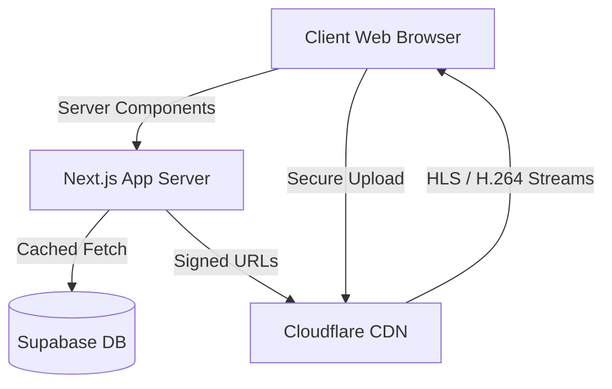

# JuneteenthTube Production Audit

This document presents a comprehensive production engineering audit of the JuneteenthTube codebase, analyzing the application's architecture, dependencies, databases, systems, and structures.

---

## 1. Architectural Overview & Component Analysis

### Key Components Reviewed

* `src/app/` (Next.js App Router Pages and Layouts)
* `src/components/` (Home, Video, and Studio UI Elements)
* `src/context/` (AuthContext, VideoContext, StateContext)
* `src/hooks/` (useDominantColor)
* `src/lib/` (Supabase, S3 client, Cloudflare loader)
* `src/types/` (Ffmpeg decls)
* `src/app/api/` (All REST endpoints and CRUD API boundaries)

### Critical Strengths

1. **Excellent Next.js Structure**: Uses the latest React 19 and Next.js 15 features like dynamic imports, React Server Components (RSC) patterns, and modular routing boundaries.
2. **Cloudflare R2 Storage Integration**: Presigned single and multipart uploads work with fine-tuned CORS handling to save bandwidth on large video assets.
3. **Netflix-grade Video Experience**: Incorporates HLS.js custom player logic, buffering spinners, dynamic bandwidth suggestions, and picture-in-picture mode.

---

## 2. Identified Bottlenecks & Code Health Concerns

### P0 Issues

#### A. VideoContext Catalog Pull (Scale & Hydration Bottleneck)

* **File**: [VideoContext.tsx](file:///c:/Juneteenthtube-Master/src/context/VideoContext.tsx)
* **Problem**: Currently performs a global `.select('*')` database query on mount. It downloads every video in the catalog to client-side state.
* **Impact**: Bandwidth consumption grows exponentially with traffic. Massive client-side memory footprint, high hydration latency, and duplicate rendering cycles when pages mount or filter categories.
* **Solution**: Migrate pages (like Explore and Home) to server-side data fetching or localized paginated database calls. Refactor `VideoContext` to only maintain transient upload/history states rather than storing the global catalogue in memory.

#### B. WatchClient HLS Memory Leak (Player Lifecycle Bug)

* **File**: [CustomPlayer.tsx](file:///c:/Juneteenthtube-Master/src/components/video/CustomPlayer.tsx)
* **Problem**: Inside the `loadSource` function, when switching between optimized and master quality modes or starting a new video, a new `Hls` instance is constructed without detaching or destroying the active instance from the HTML video element.
* **Impact**: Massive heap growth, overlapping network request queues, audio/video synchronization glitches, and browser crashes during extended sessions.
* **Solution**: Explicitly call `hlsInstanceRef.current.destroy()` before re-initializing a new Hls instance inside `loadSource`.

#### C. Unsecured Mutations (Security Vulnerability)

* **Files**: `src/app/api/videos/route.ts` (DELETE), `src/app/api/videos/create/route.ts` (POST), `src/app/api/videos/update/route.ts` (PATCH)
* **Problem**: These routes do not check authentication or authorization. Anyone can trigger arbitrary deletions, post new files, generate arbitrary views, or manipulate featured status.
* **Impact**: Malicious users could easily wipe out or deface the platform, spam transcode dispatches, and trigger high cloud costs.
* **Solution**: Implement unified authentication checks in Next.js endpoints using `supabase.auth.getUser()`, checking creator/admin ownership prior to database mutations.

---

## 3. Duplicated Code & Dead Code Analysis

1. **Supabase Client Duplication**:
   * `src/lib/supabase.ts` and `src/lib/supabase-admin.ts` are well-structured.
   * However, multiple API routes (like `api/videos/update/route.ts`) manually initialize the `createClient` inside the handler instead of reusing imports. They should consistently import `supabaseAdmin` from `@/lib/supabase-admin` to prevent redundant connection pools and initialization costs.
2. **Mock Metadata Mapping**:
   * `VideoContext.tsx` contains a static helper `getMockChannelData` that assigns names/avatars to videos client-side based on keywords. This should be moved to a relational creator/channels database join to keep the schema clean.
3. **Unused CSS Files**:
   * There are backup files like `globals_bkp.css` (77 KB) and `globals_clean.css` (75 KB) in the root. These should be removed in production deployments to avoid workspace size overhead.

---

## 4. Architectural Scaling Recommendations

1. **RSC & Edge Delivery**: Transition feed rails to Next.js Server Components. Enable Next.js segment caches (ISR/Dynamic Caching) to query the Supabase DB server-side with sub-50ms render latency.
2. **Paginated Endpoints**: Implement `page` and `limit` query parameters on `GET /api/videos` to only load the required dataset.
3. **Structured Telecom telemetry**: Track playback states and drop-out rates through a secure API logger.
